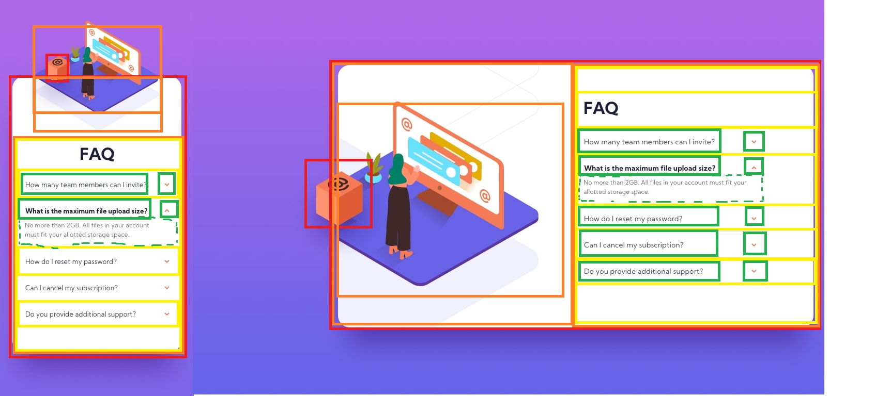

# Frontend Mentor - FAQ accordion card solution

This is a solution to the [FAQ accordion card challenge on Frontend Mentor](https://www.frontendmentor.io/challenges/faq-accordion-card-XlyjD0Oam).

## Overview

### The challenge

Users should be able to:

- View the optimal layout for the component depending on their device's screen size
- See hover states for all interactive elements on the page
- Hide/Show the answer to a question when the question is clicked

### Screenshot


### Links

- Solution URL: [Github](https://github.com/jeremylloyd/Frontend-Mentor-FAQ-accordion-card)
- Live Site URL: [Github Pages](https://jeremylloyd.github.io/Frontend-Mentor-FAQ-accordion-card/)

## My process

- Start by adding some CSS defaults
  ```
    * {
      box-sizing: border-box;
      list-style: none;
      margin: 0px;
      padding: 0px;
      text-decoration: none;
      font-family: 'Kumbh Sans';
      font-size: 12px;
    }
  ```
- Design HTML that will work in all layouts
  

### Built with

- HTML
- CSS
- A bit of JS

### What I learned

- CSS state transitions
  - Implement transition properties on the base elements rather than the pseudo-elements to ensure that it applies in both directions
  - To expand the height of an element using CSS, you can adjust the max-height
- `background-attachment: fixed` results in the background image not moving when the user scrolls
- Absolute positioning always seems to result in a mess. But absolute positioned elements can 'stick out' and look pretty cool in the process
- Make text impossible to select with `user-select: none;`
- Flip images vertically with `scaleY(-1)`
- If there are items that need to be set to `display: none` between mobile and desktop layouts, use `.desktop` and `.mobile` classes to simplify the media query
